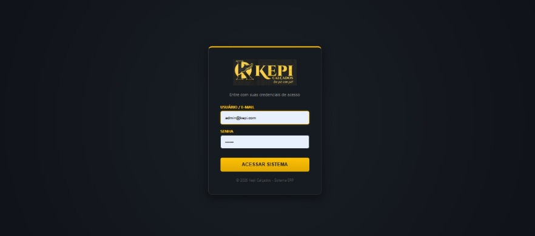
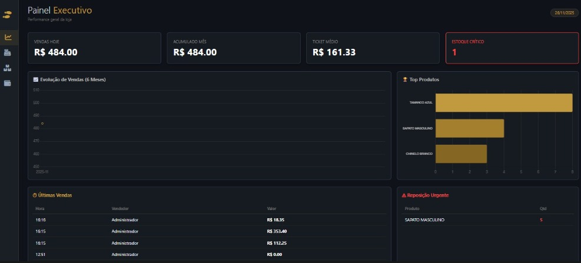

# 👞 Sistema ERP & PDV - Kepi Calçados


> **Enterprise Resource Planning (ERP)** completo para varejo de calçados. Desenvolvido com foco em **Alta Performance**, **Segurança Corporativa** e **UX Premium (Dark Luxury)**.

---

## 📸 Visão Geral

O sistema foi projetado para substituir planilhas e cadernos, oferecendo controle total sobre o fluxo de caixa, inventário e vendas. A interface utiliza uma paleta de cores escura com detalhes em dourado (`#C19A3F`) para reduzir o cansaço visual e transmitir sofisticação.


 

---

## 🚀 Funcionalidades Principais

### 📊 1. Dashboard Executivo (BI)
- **KPIs em Tempo Real:** Vendas do dia, Ticket Médio, Acumulado Mensal e Valuation do Estoque.
- **Inteligência de Dados:** Gráficos interativos (Chart.js) de evolução de vendas e produtos mais vendidos.
- **Alertas Automáticos:** Notificação visual de estoque crítico e reposição urgente.

### 🛒 2. PDV (Frente de Caixa)
- **Venda Ágil:** Interface focada em produtividade com atalhos de teclado (F1 Buscar, F2 Finalizar).
- **Flexibilidade:** Suporte a múltiplos pagamentos (PIX, Cartão, Dinheiro) e cálculo automático de troco.
- **Cupom Não-Fiscal:** Geração de comprovante de venda para impressão térmica.

### 📦 3. Gestão de Estoque (WMS)
- **Cadastro Detalhado:** Controle por SKU, Grade (Tamanhos), Categoria e Localização Física.
- **Auditoria:** Histórico de movimentação (quem alterou, quando e porquê).
- **Curva ABC:** Identificação visual de produtos com baixo giro.

### 🔐 4. Segurança & ACL (Access Control List)
- **Hierarquia de Acesso:**
  - **ADMIN:** Acesso total.
  - **GERENTE:** Gestão de equipe e relatórios.
  - **VENDEDOR:** Apenas PDV.
  - **FINANCEIRO:** Apenas fluxo de caixa.
- **Proteção:** Senhas criptografadas com `bcrypt` e sessões seguras.



---

## 🛠️ Tecnologias & Arquitetura

O projeto segue o padrão **MVC (Model-View-Controller)** adaptado para Node.js:

- **Backend:** Node.js + Express.
- **Database:** MySQL (Relacional) com driver `mysql2`.
- **Frontend:** EJS (Server-side rendering) + CSS3 (Flexbox/Grid).
- **Segurança:** `bcryptjs` (Hash de senhas) + `express-session` (Autenticação).
- **Visualização:** `Chart.js` para renderização de gráficos.

---

## 📂 Estrutura de Pastas

Para fins educacionais, a estrutura do projeto é organizada da seguinte forma:
SISTEMA_SAPATOS/
├── public/ # Arquivos Estáticos (Frontend)
│ ├── css/ # Estilos (Dark Theme)
│ └── images/ # Logos e ícones
├── views/ # Telas do Sistema (HTML/EJS)
│ ├── dashboard.ejs # Painel Principal
│ ├── pdv_pro.ejs # Tela de Vendas
│ ├── produtos.ejs # Gestão de Estoque
│ ├── financeiro.ejs # Relatórios
│ ├── login.ejs # Tela de Acesso
│ └── usuarios.ejs # Gestão de Equipe
├── node_modules/ # Dependências (npm)
├── server.js # Cérebro do Backend (Rotas e Lógica)
├── criar_admin.js # Script utilitário para resetar admin
└── README.md # Documentação

---

## ⚙️ Guia de Instalação

### 1. Pré-requisitos
Certifique-se de ter instalado:
- [Node.js](https://nodejs.org/)
- [MySQL Workbench](https://dev.mysql.com/downloads/workbench/)
- [Git](https://git-scm.com/)

### 2. Clonar e Instalar
```bash
git clone https://github.com/SEU-USUARIO/sistema-kepi.git
cd sistema-kepi
npm install

Configurar Banco de Dados
Abra seu MySQL e execute o script abaixo para criar toda a estrutura:

<details>
<summary>🔻 CLIQUE AQUI PARA VER O SCRIPT SQL COMPLETO</summary>

<br>

# sql
CREATE DATABASE loja_sapatos;
USE loja_sapatos;

# Usuários e Permissões
CREATE TABLE usuarios (
    id INT AUTO_INCREMENT PRIMARY KEY,
    nome VARCHAR(100),
    login VARCHAR(50) UNIQUE,
    senha VARCHAR(255),
    cargo ENUM('ADMIN', 'GERENTE', 'SUPERVISOR', 'FINANCEIRO', 'VENDEDOR'),
    comissao_porcentagem DECIMAL(5,2) DEFAULT 0.00,
    ativo BOOLEAN DEFAULT TRUE,
    data_criacao DATETIME DEFAULT CURRENT_TIMESTAMP
);

# Categorias
CREATE TABLE categorias (
    id INT AUTO_INCREMENT PRIMARY KEY,
    nome VARCHAR(50) NOT NULL
);
INSERT INTO categorias (nome) VALUES ('Social'), ('Esporte'), ('Casual'), ('Sandálias'), ('Botas');

# Produtos e Estoque
CREATE TABLE produtos (
    id INT AUTO_INCREMENT PRIMARY KEY,
    nome VARCHAR(100),
    sku VARCHAR(50),
    id_categoria INT,
    tamanho INT,
    preco_custo DECIMAL(10,2),
    preco_venda DECIMAL(10,2),
    estoque INT DEFAULT 0,
    estoque_minimo INT DEFAULT 5,
    localizacao VARCHAR(50),
    fornecedor VARCHAR(100),
    nf_entrada VARCHAR(50)
);

# Auditoria de Estoque
CREATE TABLE estoque_movimento (
    id INT AUTO_INCREMENT PRIMARY KEY,
    id_produto INT,
    tipo ENUM('ENTRADA', 'SAIDA', 'AJUSTE', 'DEVOLUCAO'),
    quantidade INT,
    saldo_anterior INT,
    saldo_novo INT,
    motivo VARCHAR(255),
    usuario VARCHAR(50) DEFAULT 'Sistema',
    data_movimento DATETIME DEFAULT CURRENT_TIMESTAMP
);

# Vendas
CREATE TABLE vendas (
    id INT AUTO_INCREMENT PRIMARY KEY,
    data_venda DATETIME DEFAULT CURRENT_TIMESTAMP,
    vendedor VARCHAR(50),
    total DECIMAL(10,2),
    forma_pagamento VARCHAR(50),
    desconto DECIMAL(10,2) DEFAULT 0.00,
    frete DECIMAL(10,2) DEFAULT 0.00,
    transportadora VARCHAR(100),
    data_entrega DATE NULL,
    observacoes TEXT,
    status VARCHAR(20) DEFAULT 'FECHADO'
);

# Itens da venda
CREATE TABLE itens_venda (
    id INT AUTO_INCREMENT PRIMARY KEY,
    id_venda INT,
    id_produto INT,
    quantidade INT,
    subtotal DECIMAL(10,2),
    desconto_item DECIMAL(10,2) DEFAULT 0.00,
    FOREIGN KEY (id_venda) REFERENCES vendas(id),
    FOREIGN KEY (id_produto) REFERENCES produtos(id)
);

# Fluxo de Caixa
CREATE TABLE caixa (
    id INT AUTO_INCREMENT PRIMARY KEY,
    data_movimento DATETIME DEFAULT CURRENT_TIMESTAMP,
    tipo ENUM('ENTRADA', 'SAIDA'),
    descricao VARCHAR(255),
    valor DECIMAL(10,2)
);

# Fechamento de Caixa
CREATE TABLE caixa_fechamento (
    id INT AUTO_INCREMENT PRIMARY KEY,
    data_fechamento DATETIME DEFAULT CURRENT_TIMESTAMP,
    total_entradas DECIMAL(10,2),
    total_saidas DECIMAL(10,2),
    saldo_final DECIMAL(10,2),
    observacoes TEXT
);
</details>

4. Configurar Conexão
Abra o arquivo server.js e insira sua senha do MySQL:
const db = mysql.createConnection({
    host: 'localhost',
    user: 'root',
    password: 'SUA_SENHA_AQUI', // # Coloque sua senha
    database: 'loja_sapatos'
});

5. Criar Administrador
Execute o script utilitário para gerar o primeiro acesso:
node criar_admin.js

6. Executar
node server.js
O sistema estará rodando em: http://localhost:3000

👤 Acesso Padrão
Após rodar o script de criação, utilize:
Usuário	Senha	Nível
admin@suprirepi.com	123456	Administrador

📄 Licença
Este projeto é de uso livre para fins educacionais e comerciais.
Desenvolvido por Willame Alves - Kepi Calçados Tech Team.
